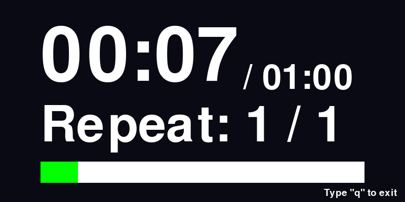

# Pytimer

簡単なタイマーです。

# Screenshot

# Usage
```bash
minitimer [-m minutes] [-s second] [-n repeat] [-r size] [-o]
-m minutes: minutes of timer
-s second: second of timer
-n repeat : the number of repeat 
-r size : the size of timer window (s/m/l) 
```
# Install
```bash
git clone https://github.com/Index700/pytimer
cd pytimer
pip3 install -r requirements.txt
```

